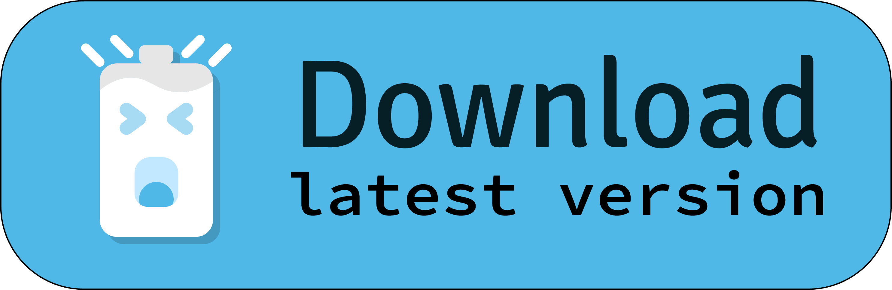
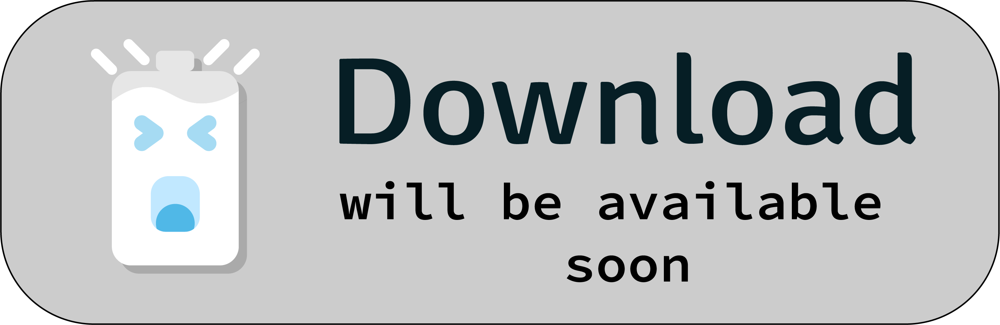
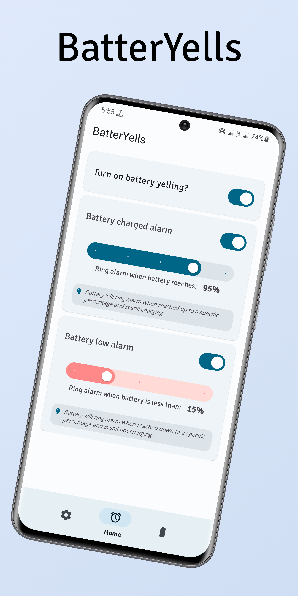
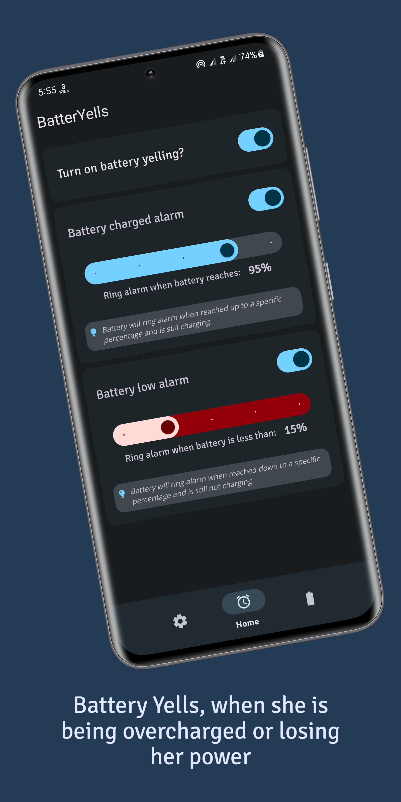
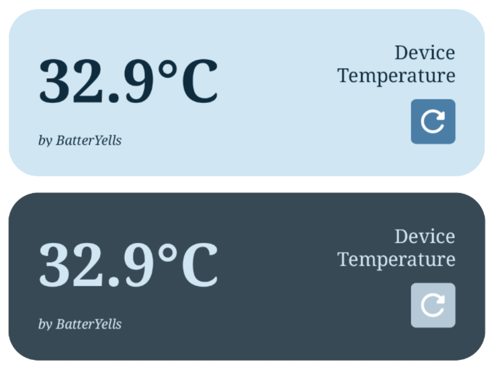

#  BatterYells - Your Battery Guardian

[//]: # ( )

## Introduction

**BatterYells** is your ultimate battery companion, designed to keep your device's battery health in check and ensure you never miss a beat due to overcharging or low battery levels. With its intuitive interface and comprehensive features.

## Features
- **Customizable Alerts:** Set personalized alerts for both overcharging and low battery levels. *BatterYells* will notify you with a gentle ring when your battery reaches the thresholds you've set, ensuring you can take timely action.

- **Battery Statistics:** Dive into detailed statistics about your battery's performance. Monitor its capacity, voltage, temperature, and other vital metrics over time, allowing you to understand your battery's behavior better.

[//]: # (- **Charging History:** Keep track of your charging sessions with a detailed history log. *BatterYells* records charging start and end times, helping you analyze your charging habits and patterns.)

[//]: # (- **Charging Time Estimation:** Get an estimated time for your battery to reach full charge based on your device's current charging rate. This feature helps you plan your charging around your schedule.)

- **Battery Health Insights:** *BatterYells* provides insights into your battery's health by analyzing its performance metrics. Receive recommendations to optimize your charging habits and extend your battery's lifespan.

- **User-Friendly Interface:** *BatterYells* boasts an intuitive and visually pleasing interface. Access all battery-related information at a glance, making it easy for both tech-savvy users and beginners to navigate.

## Screenshots
|  |  |
|-----------------------------------------------------------------------------------------------------|-----------------------------------------------------------------------------------------------------|
*Useful Widget*

## How to Contribute

Contributions to *BatterYells* are always welcome! If you have an idea for a new feature, want to report a bug, or want to contribute code, feel free to submit a pull request. For major changes, it's best to open an issue first to discuss the proposed updates.

## Installation
**For general purpose:**

1. [Download](https://raw.githubusercontent.com/acpSiam/BatterYells/master/app/release/BatterYells%20%5BV1.0%20-%20Anika%5D.apk) and install as like an usual app. The app is not yet available in the app stores. So github is currently the only source of getting the app.

**For Devs** To get started with *BatterYells*, follow these steps:

1. Clone this repository to your local machine using `git clone <repository-url>`.
2. Open the project in Android Studio.
3. Build the app and run it on an Android emulator or physical device.

## Feedback and Support

If you encounter any issues while using the app or have any suggestions for improvement, please feel free to open an issue on this GitHub repository. We value your feedback and will do our best to address your concerns.

## License

*BatterYells* is open-source project available for anyone.

--- _With BatterYells, your device's battery becomes more than just a power source – it becomes a carefully monitored and optimized asset. Download the app today and let your battery yell when it needs attention!_

## _Yes! Battery yells when she is being overcharged or out of power_